QUICK START GUIDE:

mkdir build

cd build

cmake ..

cmake --build .

you'll find the executable in the build directory.

------------------------------------------------------
# My Project Readme

## Images

Here are some visual assets from my project:

### Albedo Map
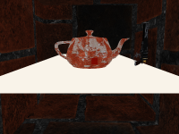

### Ambient Occlusion (AO)
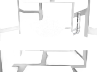

### Horizontal Blur
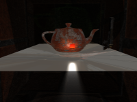

### Vertical Blur
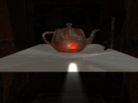

### Brightness Mask
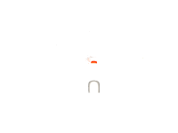

### Combined Image
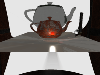

### Depth Map
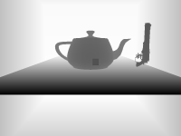

### Depth of Field

### God Ray Effect
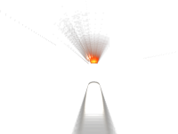

### Light Map
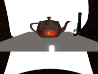

### Metallic Map
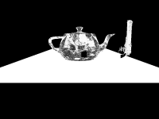

### Normal Map
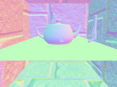

### Position Map
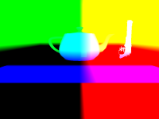

### Post-processing
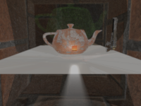

### Roughness Map
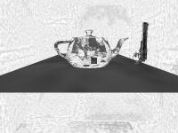

### Skybox
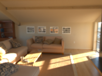

### Screen Space Reflections (SSR)
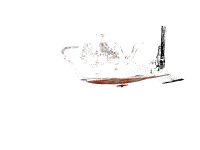

----------------------------------------------------

## Rendering Process
1. Sky Pass

    Result: A picture showing only the sky and environment.

2. Shadow Pass

    Result: A "shadow map" that records where shadows fall.

3. G-Buffer Pass (Geometry Buffer Pass)

    Result: A collection of "X-ray plates" containing all the necessary information to render objects, but without their final color.

    Position Plate: Records the exact 3D spatial position of each point.

    Normal Plate: Records the surface orientation of each point (how light reflects differently based on direction).

    Albedo Plate: Records the object's base color.

    Roughness Plate: Records how smooth or rough the object's surface is.

    Metallic Plate: Records whether the object is a metallic material.

    Ambient Occlusion Plate (AO): Records how dark certain areas (like cracks or corners) appear due to being obstructed from ambient light.

    Depth Plate: Records how far each point is from the camera.

4. OIT Pass (Order-Independent Transparency)

    Result: Processed transparent object visuals, ready to be combined with other parts of the scene later.

5. Light Pass

    Result: A picture showing only the direct lighting effects.

6. Brightness Mask Pass

    Result: A "mask image" that highlights only the brightest areas.

7. God Ray Pass

    Result: A picture showing only the volumetric light effect.

8. IBL Pass (Image-Based Lighting)

    Result: A picture including environmental lighting and reflection effects.

9. SSR Pass (Screen Space Reflection)

    Result: A picture showing only the screen-space reflection effects.

10. Combined Pass

    Result: A complete image incorporating all lighting and special effects.

11. Blur Horizontal Pass & Blur Vertical Pass

    Result: A blurred image.

12. Depth of Field Pass

    Result: An image with a depth-of-field effect.

13. Post Pass

    Result: The final, enhanced image.

14. Screen Pass

    Result: The image you see on your display.

## How It Works
The entire process operates like an assembly line, with each step focusing on a specific task. Ultimately, all these effects are layered together to create the realistic and detailed computer graphics you see.